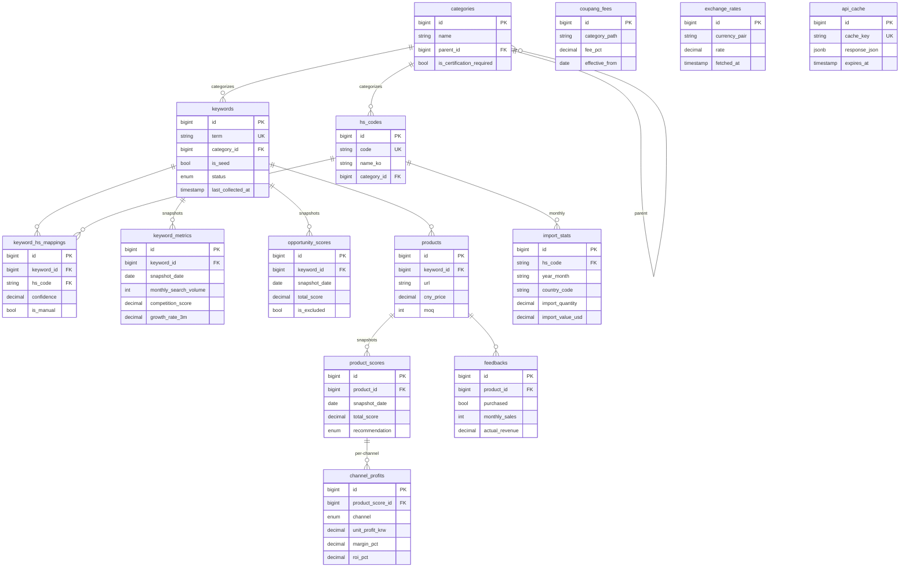

# itemSelector — Database Schema

PostgreSQL 16 / SQLAlchemy 2.x ORM models, materialized via Alembic
(`backend/alembic/versions/0001_initial_schema.py`).

* All tables include `id BIGSERIAL PK`, `created_at TIMESTAMPTZ`, `updated_at TIMESTAMPTZ`.
* All FKs use named constraints (see `app/db/base.py` for the naming convention).
* Time-series tables (`keyword_metrics`, `opportunity_scores`, `import_stats`,
  `product_scores`) are append-only snapshots keyed by date, not mutated in place.

---

## 1. Tables

### 1.1 categories

| column | type | notes |
|---|---|---|
| id | BIGSERIAL PK | |
| name | VARCHAR(100) NOT NULL | |
| parent_id | BIGINT FK→categories.id | RESTRICT (cannot drop a parent that still has children) |
| is_certification_required | BOOLEAN NOT NULL DEFAULT false | KC/식약처 등 인증 필수 카테고리 표시 |

Self-referential hierarchy. The seed creates `반려동물용품` (root) +
5 children: 사료 / 간식 / 장난감 / 위생용품 / 케이지.

### 1.2 hs_codes

| column | type | notes |
|---|---|---|
| id | BIGSERIAL PK | |
| code | VARCHAR(10) NOT NULL UNIQUE | 6 또는 10자리 (CHECK constraint) |
| name_ko | VARCHAR(255) NOT NULL | |
| name_en | VARCHAR(255) | |
| category_id | BIGINT FK→categories.id | SET NULL on delete |

`code` is stored as text to preserve leading zeros (관세청 응답 포맷과 일치).

### 1.3 keywords

| column | type | notes |
|---|---|---|
| id | BIGSERIAL PK | |
| term | VARCHAR(255) NOT NULL UNIQUE | 검색 키워드 |
| category_id | BIGINT FK→categories.id | SET NULL |
| is_seed | BOOLEAN NOT NULL DEFAULT false | 사용자 입력 seed 여부 |
| status | ENUM('PENDING','ACTIVE','DEPRECATED','EXCLUDED') | |
| last_collected_at | TIMESTAMPTZ | 마지막 수집 시점 |

### 1.4 keyword_hs_mappings

| column | type | notes |
|---|---|---|
| id | BIGSERIAL PK | |
| keyword_id | BIGINT FK→keywords.id | CASCADE |
| hs_code | VARCHAR(10) FK→hs_codes.code | CASCADE |
| confidence | NUMERIC(4,3) NOT NULL DEFAULT 0 | 0~1 (CHECK) |
| is_manual | BOOLEAN NOT NULL DEFAULT false | 사용자 수동 매핑이면 true |

UNIQUE (keyword_id, hs_code).

### 1.5 keyword_metrics  (time series)

| column | type | notes |
|---|---|---|
| id | BIGSERIAL PK | |
| keyword_id | BIGINT FK→keywords.id | CASCADE |
| snapshot_date | DATE NOT NULL | |
| monthly_search_volume | INTEGER | |
| competition_score | NUMERIC(6,3) | 네이버 검색광고 경쟁정도 |
| naver_shopping_count | INTEGER | |
| blog_post_count | INTEGER | |
| youtube_video_count | INTEGER | |
| growth_rate_3m | NUMERIC(7,4) | -1.0 ~ +N |
| growth_rate_6m | NUMERIC(7,4) | |

UNIQUE (keyword_id, snapshot_date). Index on (keyword_id, snapshot_date).

### 1.6 import_stats

| column | type | notes |
|---|---|---|
| id | BIGSERIAL PK | |
| hs_code | VARCHAR(10) FK→hs_codes.code | CASCADE |
| year_month | VARCHAR(7) NOT NULL | `YYYY-MM` |
| country_code | VARCHAR(3) NOT NULL DEFAULT 'CN' | |
| import_quantity | NUMERIC(20,3) | |
| import_value_usd | NUMERIC(20,2) | |

UNIQUE (hs_code, year_month, country_code). Index on (hs_code, year_month).

### 1.7 opportunity_scores  (time series)

기획서 §4.2 의 100점 분해.

| column | type | notes |
|---|---|---|
| id | BIGSERIAL PK | |
| keyword_id | BIGINT FK→keywords.id | CASCADE |
| snapshot_date | DATE NOT NULL | |
| total_score | NUMERIC(6,2) | 0~100 |
| demand_score | NUMERIC(6,2) | 25점 만점 |
| growth_score | NUMERIC(6,2) | 20점 |
| competition_score | NUMERIC(6,2) | 20점 |
| customs_score | NUMERIC(6,2) | 20점 (관세청 수입 실체) |
| trend_score | NUMERIC(6,2) | 10점 |
| stability_score | NUMERIC(6,2) | 5점 |
| is_excluded | BOOLEAN NOT NULL DEFAULT false | 자동 제외 필터 적용 결과 |
| exclusion_reasons | TEXT | |

Index on (snapshot_date, total_score) → "오늘의 TOP N" 조회 핵심.

### 1.8 products

| column | type | notes |
|---|---|---|
| id | BIGSERIAL PK | |
| keyword_id | BIGINT FK→keywords.id | SET NULL |
| url | VARCHAR(2048) NOT NULL | 1688 상품 URL |
| name | VARCHAR(500) | |
| cny_price | NUMERIC(12,2) NOT NULL | CNY 단가 |
| moq | INTEGER NOT NULL | |
| image_url | VARCHAR(2048) | |
| notes | TEXT | |
| created_by_user | VARCHAR(255) | |

### 1.9 product_scores

| column | type | notes |
|---|---|---|
| id | BIGSERIAL PK | |
| product_id | BIGINT FK→products.id | CASCADE |
| snapshot_date | DATE NOT NULL | |
| total_score | NUMERIC(6,2) | |
| opportunity_score | NUMERIC(6,2) | 40점 |
| profit_score | NUMERIC(6,2) | 35점 |
| risk_score | NUMERIC(6,2) | 15점 |
| stability_score | NUMERIC(6,2) | 10점 |
| recommendation | ENUM('GO','CONDITIONAL','PASS') NOT NULL | |

UNIQUE (product_id, snapshot_date).

### 1.10 channel_profits

| column | type | notes |
|---|---|---|
| id | BIGSERIAL PK | |
| product_score_id | BIGINT FK→product_scores.id | CASCADE |
| channel | ENUM('SMARTSTORE','COUPANG') NOT NULL | |
| unit_cost_krw | NUMERIC(12,2) | |
| expected_price_krw | NUMERIC(12,2) | |
| platform_fee_pct | NUMERIC(6,3) | |
| ad_cost_pct | NUMERIC(6,3) | |
| unit_profit_krw | NUMERIC(12,2) | |
| margin_pct | NUMERIC(6,3) | |
| roi_pct | NUMERIC(7,3) | |
| breakeven_units | INTEGER | |

UNIQUE (product_score_id, channel).

### 1.11 feedbacks

| column | type | notes |
|---|---|---|
| id | BIGSERIAL PK | |
| product_id | BIGINT FK→products.id | CASCADE |
| purchased | BOOLEAN NOT NULL DEFAULT false | |
| monthly_sales | INTEGER | |
| actual_revenue | NUMERIC(14,2) | |
| notes | TEXT | |
| recorded_at | TIMESTAMPTZ NOT NULL | |

### 1.12 coupang_fees

쿠팡 카테고리별 수수료 (기획서 §9 초기치). `effective_from` 으로 시점별 변경 보존.

UNIQUE (category_path, effective_from).

### 1.13 exchange_rates

CNY/KRW 환율 캐시. 매 fetch마다 새 row.
Index on (currency_pair, fetched_at).

### 1.14 api_cache

| column | type | notes |
|---|---|---|
| id | BIGSERIAL PK | |
| cache_key | VARCHAR(512) NOT NULL UNIQUE | |
| response_json | JSONB NOT NULL | |
| expires_at | TIMESTAMPTZ NOT NULL | |

쿠팡 파트너스 API 1시간 10회 제약 대응용 24h 캐시. Index on
`expires_at` 으로 만료 row 청소 잡 빠르게.

---

## 2. ERD

---

## 3. Future tables (planned)

- `collection_runs` — 배치 실행 로그 (Scheduler Agent 산출물). 잡명 / 시작/종료 / 성공·실패 / 처리 row 수.
- `weight_history` — 점수 가중치 변경 이력 (Phase 4 피드백 학습).
- `users` / `api_tokens` — 다중 사용자 지원 시. 현재는 단일 사용자 가정이라 미정의.
- `notifications` — 캐시 채워졌을 때 사용자 알림 큐 (Backend API Agent 도입 시).
